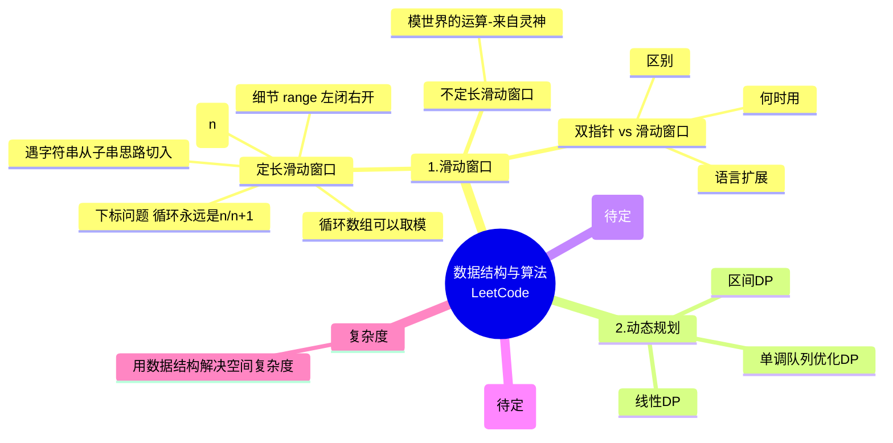

# 数据结构与算法 · LeetCode 刷题笔记

## 思维导图

> 原始思维导图图片见 [images/](images/) 目录。

---

## 专题导航

| # | 专题 | 子分类 | 题目数 |
|---|------|--------|--------|
| 01 | [滑动窗口](01-滑动窗口/README.md) | [定长](01-滑动窗口/定长/) · [不定长](01-滑动窗口/不定长/) · [单调队列](01-滑动窗口/单调队列+滑动窗口/) | 35 |
| 02 | [动态规划](02-动态规划/README.md) | [单调队列优化DP](02-动态规划/单调队列优化DP/) | 2 |
| 03 | [单调栈](03-单调栈/README.md) | — | 2 |
| 04 | [数学算法](04-数学算法/) | — | 持续更新 |

---

## 通用复杂度备忘

| 操作 | 数据结构 | 时间复杂度 |
|------|---------|-----------|
| 滑动窗口最值 | 单调队列 deque | O(1) 均摊 |
| 动态规划窗口最值 | 单调队列优化 | O(n) |
| 下一个更大元素 | 单调栈 | O(n) |
| 区间和查询 | 前缀和 | O(1) 查询 |

> **解决空间复杂度：用合适的数据结构代替暴力枚举。**
